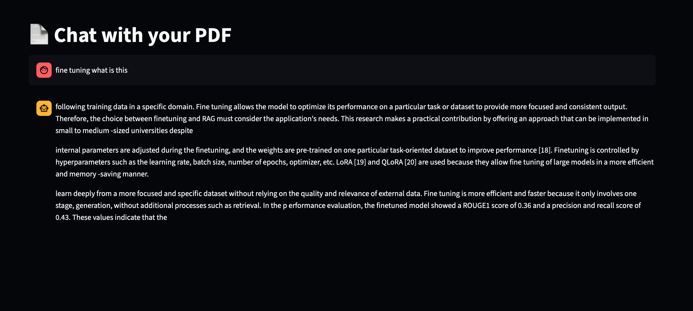
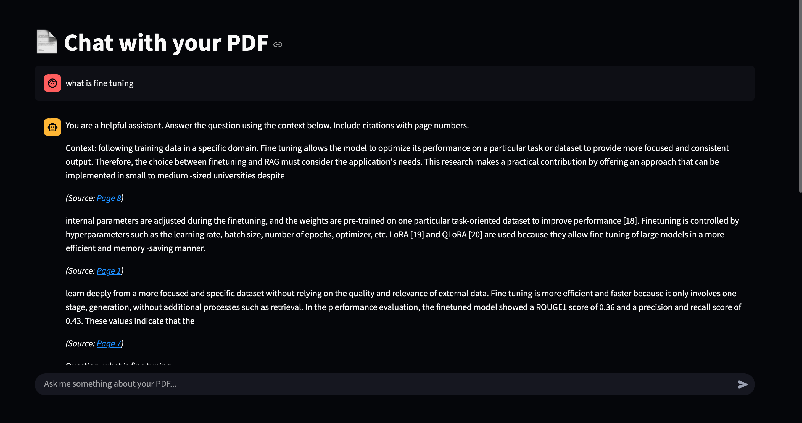

📄 RAG PDF Chatbot
This project is a Retrieval-Augmented Generation (RAG) based chatbot that allows you to chat with your PDFs. It uses HuggingFace sentence-transformer embeddings and ChromaDB for semantic search, combined with a local LLM for generating context-aware answers.
🚀 Features
🔍 Upload & Ingest PDFs – Split documents into chunks and store them in ChromaDB.
🤖 Local LLM Response – Uses a local language model for answering queries (no OpenAI API required).
🧠 Conversational Memory – Maintains chat history per session with a session ID.
📑 Citations – Provides clickable links to the PDF page numbers where the answer was generated from.
⚡ Fast & Private – Runs entirely on your local machine.
🛠️ Tech Stack
Frontend: Streamlit
Vector Database: ChromaDB
Embeddings: HuggingFace (all-MiniLM-L6-v2)
LLM: Local model (can be replaced with GPT4All, LLaMA, or other HuggingFace models)
Environment Management: Python + dotenv
📂 Project Structure
├── app.py          # Streamlit app (frontend)  
├── backend.py      # Query handling, memory, and LLM pipeline  
├── ingest.py       # PDF ingestion and vectorstore creation  
├── utils.py        # Helpers & environment setup  
├── vectorstore/    # ChromaDB persistent storage  
├── requirements.txt
⚡ How It Works
Run ingest.py to load your PDF and create a vectorstore.
Start the chatbot with:
streamlit run app.py
Ask questions about your PDF and get context-aware answers with citation
## 📸 Screenshots

### Chat Interface

### PDF Upload

